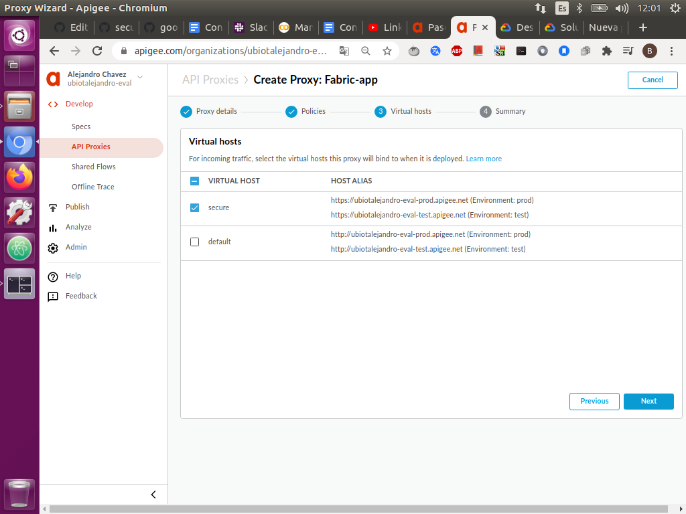

# Conectar a apigee.
 
* Antes de empezar deberá tener una cuenta de apigee creada, sino la tiene puede seguir los siguientes pasos para crear una [cuenta de  evaluación](https://docs.apigee.com/api-platform/get-started/creating-apigee-edge-account).
 
 
  - Vaya a la página de [login del apigee](https://login.apigee.com/sign_up.) e ingrese a su cuenta de apigee.
 
 
  - Una vez allí haga click en API Proxy en la ventana principal. 

 
   - Haga clic en +Proxy. 
   
     
 
 
   - Haga clic en Proxy inverso (más común).
  
     
 
    - Configure los detalles de su proxy de la siguiente manera:
      
       - Nombre: ingrese un nombre cualquiera,  si ya existe un proxy con este nombre, utilice un nombre diferente.
 
       - Ruta base: asegúrese de que esté vacía o con solo un “/”.
 
       - Destino (API existente): ingrese https://dtc.systemas . Esto define la URL de destino que Apigee Edge invoca en una solicitud al proxy de API.
 
         
  
       - Haga clic en Siguiente .
  
     - En la página Políticas comunes: 
 
        - En Seguridad: 
 
             - Autorización, asegúrese de que Transmitir (sin autorización) esté seleccionado y haga clic en Siguiente .
  
               
 
     - En la página de hosts virtuales.
        
        - Seleccione secure y haga clic en Siguiente.
 
          
 
     - En la página Resumen: 
      
        - Asegúrese de que el entorno de prueba esté seleccionado en Implementación opcional y haga clic en Crear e implementar 
 
          
 
    - Apigee crea su nuevo proxy de API y lo implementa en su entorno de prueba:
 
      
 
 
    - Haga clic en Editar proxy para mostrar la página de descripción general del proxy de API.
 
 
    - Allí debera ver el link que da el apigee por defecto.
 
      
 
    - Una vez creado verifique si puede acceder a la aplicación pinchando el link.
    
    
