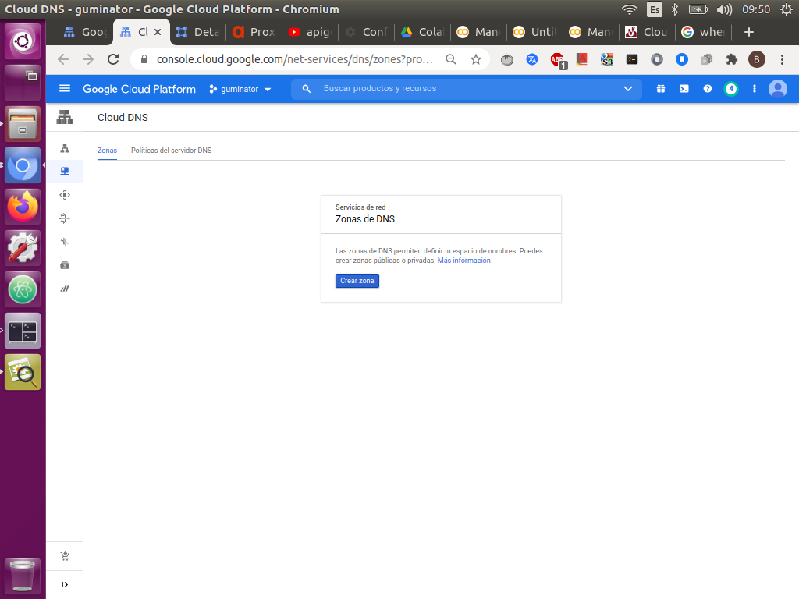
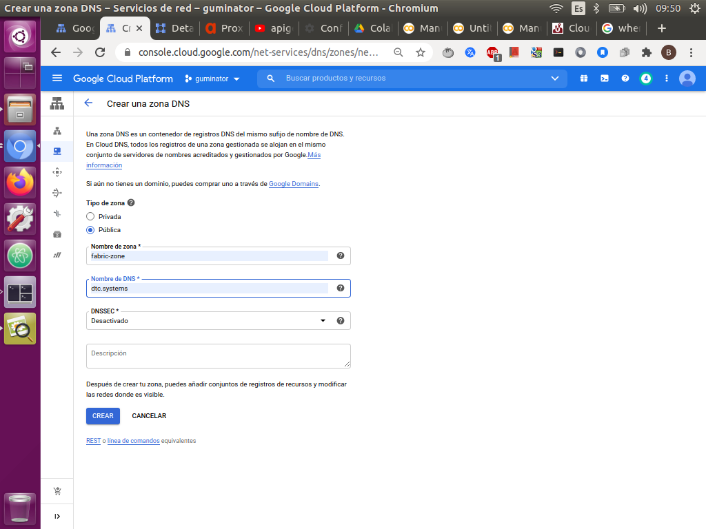
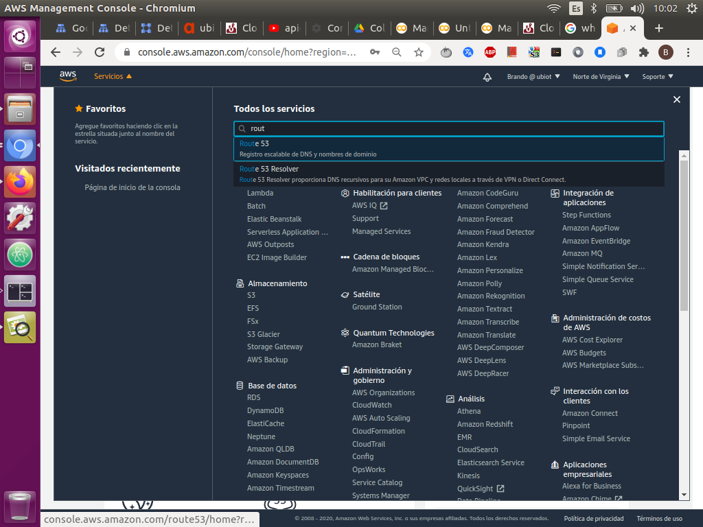
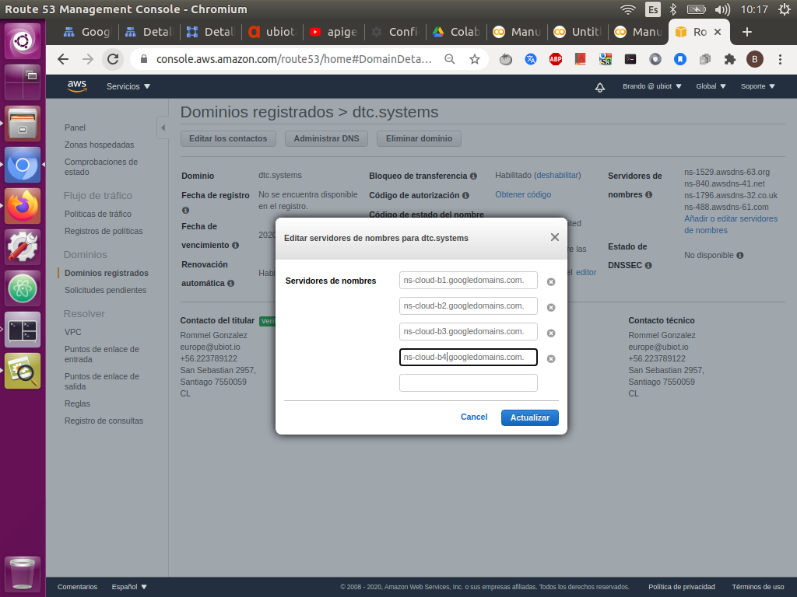
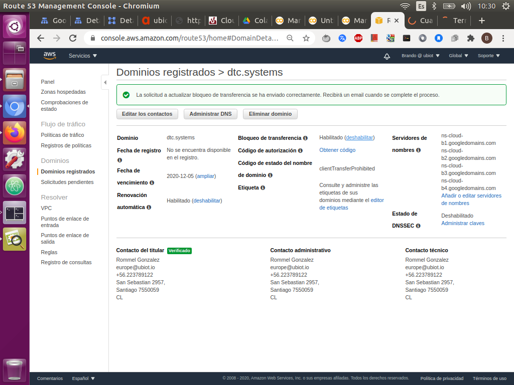
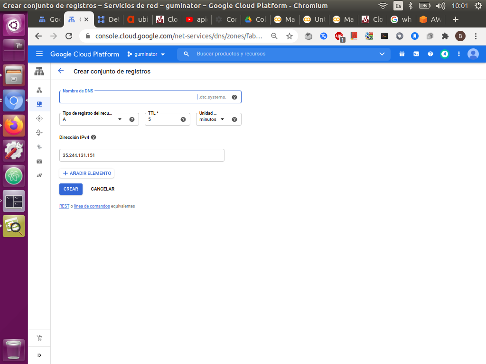
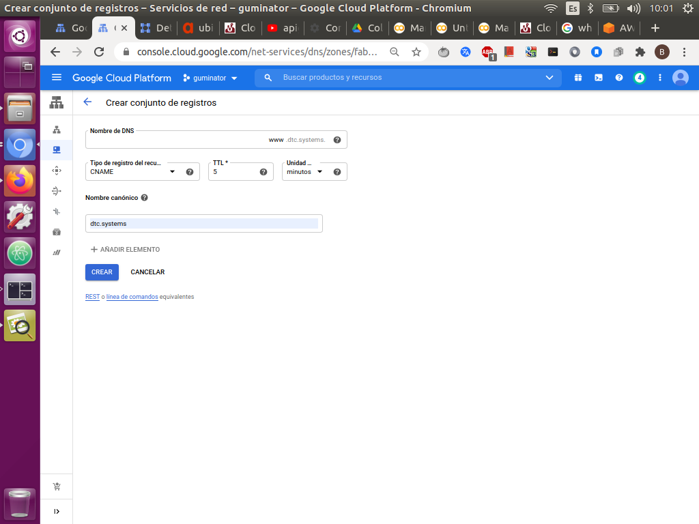
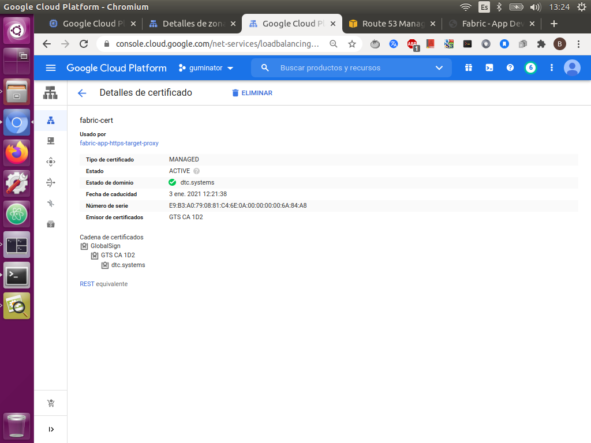

#  Conexión del load Balancing al dominio.
 
Para conectar el load balancind al domino que está en AWS debemos hacer lo siguiente:
 
* Crear una zona dns en gcp usando cloud dns:
 
   - Ve a la página sobre cómo crear una zona de DNS en Cloud Console.
 [Cloud DNS](https://console.cloud.google.com/networking/dns/zones/~new?_ga=2.12228724.1577132522.1603220388-459450626.1601906451&_gac=1.251525492.1603290227.Cj0KCQjwuL_8BRCXARIsAGiC51BdtPExmWw2X24PAqMjlvrRMdOr96slsvmu_BVtttXqJlonboVFsRgaAta4EALw_wcB]
 
   - Haz click en crear nuevas zona. 
   
    
  
    - Elige Public para Tipo de zona.
 
    - Ingresa un nombre de zona. Un ejemplo es my-new-zone.
 
    - Ingresa un sufijo de nombre de DNS para la zona mediante el uso de un nombre de dominio de tu propiedad en este caso el que utilizamos es el “dtc.sytems”.
 
    - En DNSSEC, selecciona Off
 
 

* Creando una zona en la nube DNS.
  
  - Luego nos dirigimos a nuestra zona, deberíamos ver algo como esto. 
 

  
 
* Configurar AWS para que apunte a los servidores de gcp.
 
 
   - Ahora, la lista de enlaces que vemos dentro del cuadro rojo son los servidores de nombres proporcionados por GCP.
 
   - Necesitamos agregarlos a nuestra administración de dominio para que el proveedor del dominio tenga la idea de hacia dónde debe apuntar el dominio. 
 
   - En este caso, los servidores de nombres son proporcionados por GCP.
 

* Para hacer esto debemos:
 
   - Ir a la consola de amazon web services.
 
   - Ir a la sección de Amazon route 53.
  
  
 
   - Una vez allí ir a la sección dominios registrados y hacer click en el nombre de dominio en esta caso “dtc.sytems”.
 
   - En la sección de editar o agregar servidores de nombre le damos click en agregar o cambiar.
 
   - Y colocamos todos los servidores de nombres proporcionados por nuestra zona en gcp, sustituyendo los que tiene por defecto  y los guardamos.
  
  
  
  
 
Nota: se recomienda guardar los servidores que tiene por defecto aws por si quiere restablecer la configuración.

Nota 2: Se recomienda desabilitar la opción de bloqueo de transferencia para evitar que haya algún inconveniente durante la conexión entre gcp y aws.
 
 
* Registro de la Aplicacíon en la zona.
  
  - Ahora, para configurar el registro de la aplicación en el dominio regresamos a nuestra zona en la página de DNS de la nube de GCP.
 
  - Haga clic en el botón "Agregar conjunto de registros " y proporcione la dirección IP del balancer para que apunte al dominio. y luego presione crear.
 
 
 
  - Luego agregamos otro registro con las iniciales “ www ”, cambiamos el “ Tipo de registro de recursos ” a CNAME y proporcionamos el “ Nombre canónico” que será el dominio real, en nuestro caso dtc.systems.
 
  
 
  - Con esto, se completa la configuración de nuestros Dominios.
 
  - Ahora solo queda esperar como una hora para que la ip del balancing se registre al dominio, para comprobar dirígete al balancing y verifica que el certificado se haya validado.
  
  
 
  - Si se valido ya podrás ingresar a la página de dtc.systems, y ver la app.
 
