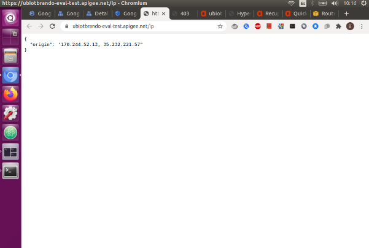
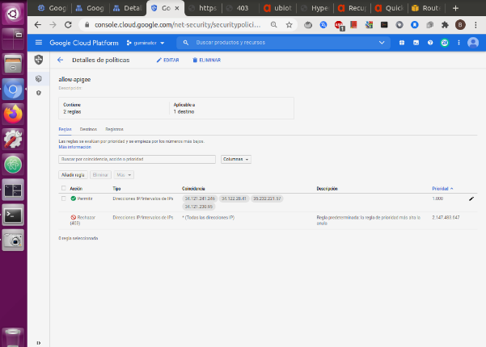
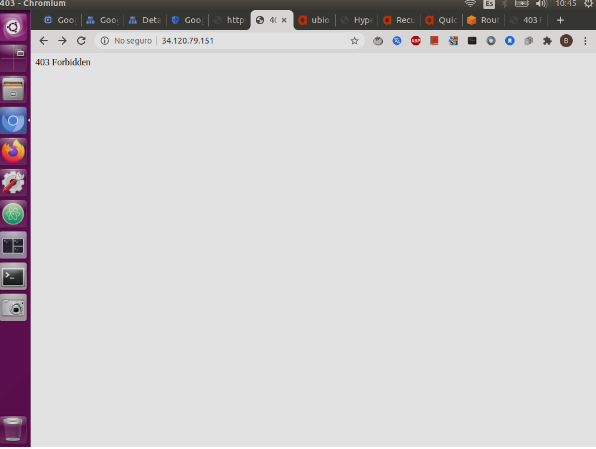

# Cloud Armor:
 
Si queremos limitar el acceso al link del load balancing para que solo se pueda llegar a través del apigee, podemos usar cloud armor un servicio de gcp que nos permite limitar el acceso a la aplicación.
 
* En Google Cloud Console, ve a la página Seguridad de red.
 
* [Ir a la página Seguridad de red](https://console.cloud.google.com/net-security/?hl=es-419&_ga=2.242283714.1577132522.1603220388-459450626.1601906451&_gac=1.81246309.1603290227.Cj0KCQjwuL_8BRCXARIsAGiC51BdtPExmWw2X24PAqMjlvrRMdOr96slsvmu_BVtttXqJlonboVFsRgaAta4EALw_wcB) 

* En la página Políticas, haz clic en Crear política.
 
* En el campo Nombre, ingresa Fabric-clients.
 
* En el campo Descripción, ingresa Policy for external users.
 
* En Acción de la regla predeterminada, selecciona Rechazar esto es para rechazar el acceso desde cualquier ip.
 
* En Estado de rechazo, selecciona 404 (No encontrado) el cual es el mensaje que aparecerá cuando intentemos conectarnos al link de la app.
 
* Haga clic en Siguiente paso.
 

Agrega más reglas:
 
* Haga clic en Agregar regla.
 
* En el campo Descripción, ingresa allow traffic from .
 
* En Modo, selecciona Modo básico (sólo direcciones IP o rangos de IP).
 
* En el campo Coincidencia, ingresa las ip del proxy del apigee.
 
* Para obtenerlas create un proxy en apigee que apunte a la dirección http://httpbin.org/ip.
 
* Esto me permite saber cuales son las direcciones ip de los servicios que se conectan a esta página. 
 
* De allí hay dos campos el primero es la ip de nuestro router, y el segundo corresponde al apigee, este en particular cada vez que se recarga la página cambia en un rango de cuatro ip.
 

 
 
* Entonces en cloud armor se colocan esas cuatro direcciones.
 
 

* Luego de colocarlas, en Acción, seleccione permitir de esta forma le otorgamos a apigee ser el unico medio de conexión a la app.
 
* En el campo Prioridad, ingresa 1000.
 
* Haga clic en Listo.
 
* Haga clic en Siguiente paso.
 
* Aplica políticas a los objetivos:
 
* Haga clic en Agregar destino.
 
* En la lista Destino, selecciona un objetivo en este caso deberá aparecer su servidor de backend creado en el load balancing.
 
* Haga clic en Listo.
 
* Espere un rato y pruebe conectarse desde su máquina debería ver un mensaje de 404.

 

* Ahora intente conectarse desde el apigee y deberá poder tener acceso.

# Borrar Políticas:

* En Google Cloud Console, ve a la página Seguridad de red.

* [Ir a la página Seguridad de red](https://console.cloud.google.com/net-security/?hl=es-419&_ga=2.242283714.1577132522.1603220388-459450626.1601906451&_gac=1.81246309.1603290227.Cj0KCQjwuL_8BRCXARIsAGiC51BdtPExmWw2X24PAqMjlvrRMdOr96slsvmu_BVtttXqJlonboVFsRgaAta4EALw_wcB) 

* En la página Políticas de seguridad, haz clic en el nombre de la política de seguridad. Se muestra la página Detalles de la política.

* En el centro de la página, en la pestaña Reglas, selecciona la casilla de verificación junto a la regla que deseas borrar.

* Haz clic en Borrar.
