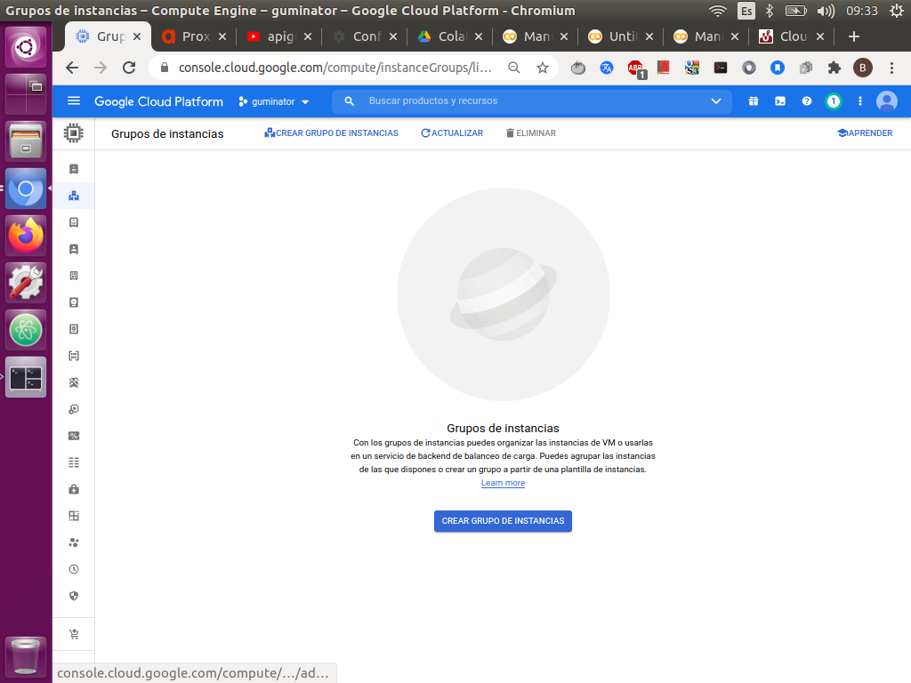
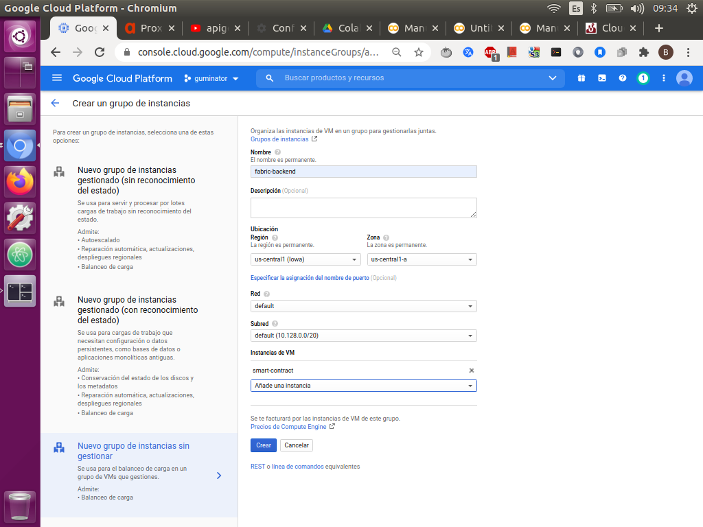
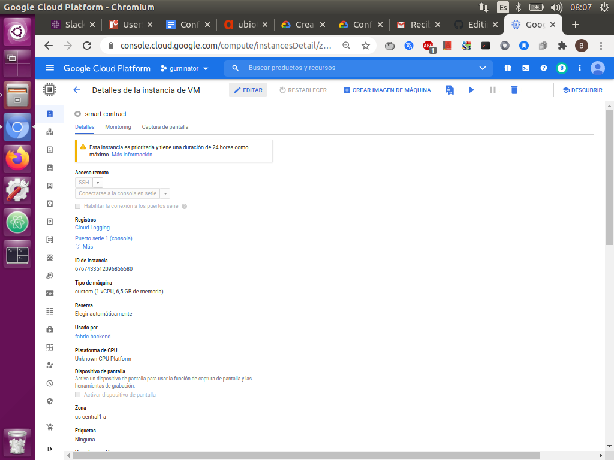
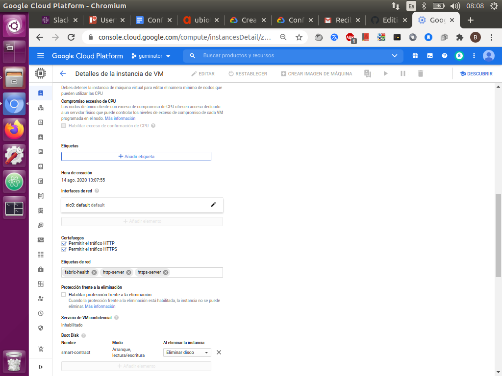
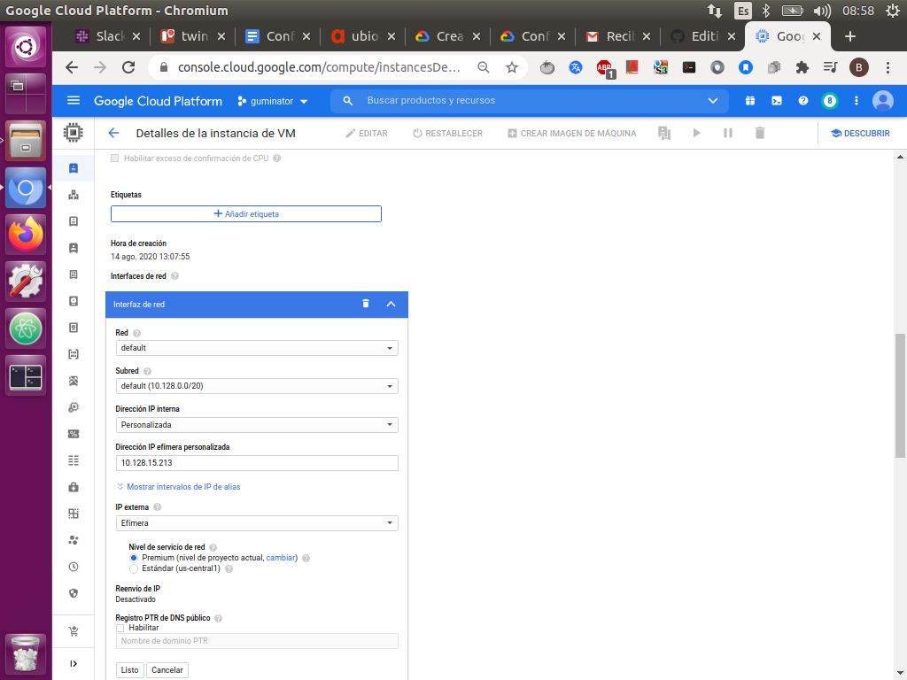
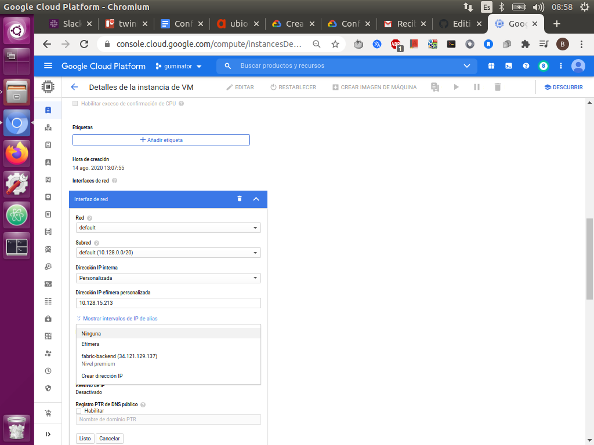
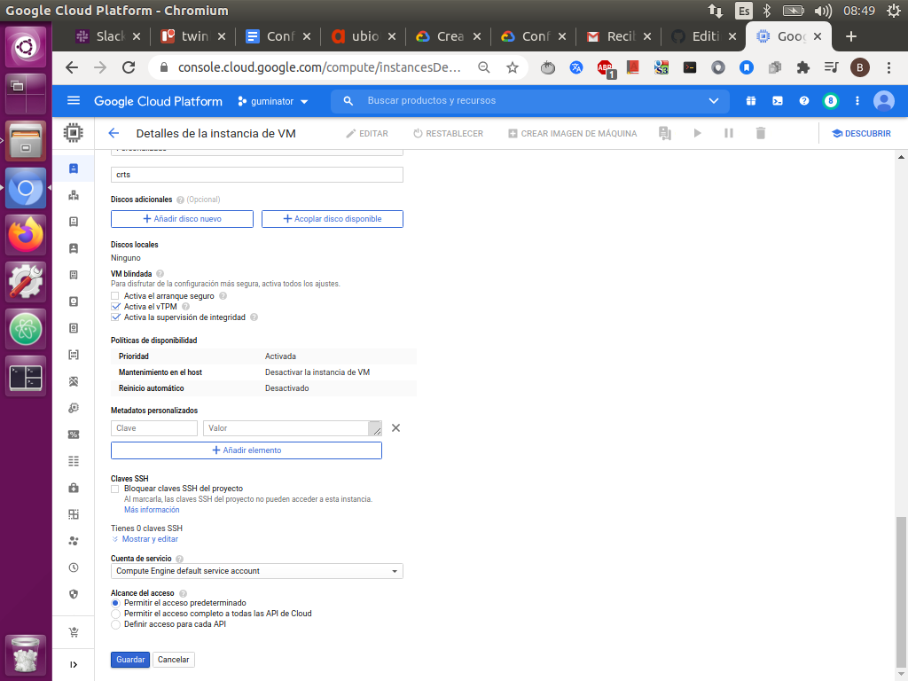

# 1) Crear un grupo de instancias no administrado.


* En Cloud Console, ve a la página Grupos de instancias.

[](https://console.cloud.google.com/compute/instanceGroups/list?authuser=0&project=guminator&instanceGroupsTablesize=50)

* Haz clic en Crear un grupo de instancias.




* Haz clic en Grupo de instancias no administrado nuevo.
 

* Ingresa un nombre para el grupo de instancias no administrado.


* En agregar un puerto selecciona el puerto 443 o el p y como nombre pon http.

* En Ubicación, selecciona una región y una zona.

* Selecciona una Red y una Subred.

* En Instancias de VM, selecciona las VM que desees agregar a este grupo en este caso agrega la que correrá en nuestra aplicación.

# Ejemplo:




* Has click en crear.
---

# 2) Conectarse a la instancia

- En GCP Console, ve a la página Instancias de VM.

- En la lista de instancias de máquinas virtuales, haz clic en SSH en la fila de la instancia a la que deseas conectarte, para este caso nos conectaremos a una instancia diferente a la del grupo de instancia.

- Esto se debe  a que la instancia en la que correrá la aplicación, no tendra ip externa por lo que no podremos conectarnos a ella desde fuera de la red, de manera que solo se podra llegar a ella a tráves de una conexión  dentro de la misma red.

- Debes tener en cuenta que esta debe estar en la misma zona que la instancia con la aplicación.


- Ahora tienes una ventana de la terminal para interactuar con tu instancia de Linux.

- Para desconectarse simplemente cierra la ventana del ssh.

- Esta vm la llamaremos host bastión, y será nuestra forma de ingresar a la vm para levantar la red, una vez en en el host bastion nos conectaremos a la instancia que correrá la aplicación la cual llamaremos backend a través de la ip interna:


```
# La zona que aquí se coloco, es de ejemplo si tu máquina usa una zona diferente tendrás que cambiarla
gcloud compute ssh [nombre de la vm] --internal-ip --zone=us-central1-a

# si los paquetes de la aplicación y la red se encuentran en un usuario predeterminado:

gcloud compute ssh [usuario]@[nombre de la vm] --internal-ip --zone=us-central1-a 
```
* Una vez listo  estaremos conectados.


# 3) Eliminar la ip externa a la instancia:


* Ir a la página Instancias de VM.

 [](https://console.cloud.google.com/compute/instances?hl=es&_ga=2.6986610.1577132522.1603220388-459450626.1601906451&_gac=1.93715951.1603290227.Cj0KCQjwuL_8BRCXARIsAGiC51BdtPExmWw2X24PAqMjlvrRMdOr96slsvmu_BVtttXqJlonboVFsRgaAta4EALw_wcB)

* Haz click en la instancia que tiene tu solución ya levantada.

 

* Esto te llevara a una sección donde observaras todas las configuraciones que tiene la máquina.
  
  
* En la esquina superior izquierda darle en la opción que dice editar.



* Ir a la sección de interfaces de red.

 

* Pinchar el icono de en la esquina.

 

* En la sección ip externa elegir la opción de ninguna y luego pulsar listo.

 

* Por último le damos en guardar.

  
 

* Notaras que no podras hacer una update eso es porque la instancia al no tener ip externa no tendra acceso a la red.


# 4) Conexión a Cloud NAT:

A pesar que nuestra solución no tiene ip externa, es necesario que esta pueda conectarse a internet de forma segura, ya que la mayoría de las funciones, envían mensajes a un nodo de iota que se encuentra en la red.

Para realizar esto se usa un servicio llamado Cloud NAT  donde puedes aprovisionar instancias que no tengan direcciones IP públicas, para que así puedan acceder a Internet de forma controlada y eficiente para hacer distintas operaciones, como aplicar actualizaciones y parches o gestionar la configuración, entre otras. 

Los recursos externos no pueden acceder directamente a ninguna de las instancias privadas ubicadas tras la pasarela de Cloud NAT, lo que contribuye a que tus redes privadas virtuales (VPC) de Google Cloud permanezcan aisladas y protegidas.


En nuestro caso usamos una configuración básica de  Cloud NAT:


* En Google Cloud Console, ve a la página de Cloud Nat.

* [Ir a la página de Cloud NAT](https://console.cloud.google.com/net-services/nat/list?hl=es&_ga=2.10075125.1577132522.1603220388-459450626.1601906451)

* Haz clic en Comenzar o Crear la puerta de enlace NAT.

* Ingresa un Nombre de puerta de enlace.

* Elige una red de VPC la de nosotros es la default.

* Configura la Región para la puerta de enlace NAT, en este caso debe ser la misma que usa la máquina con la aplicación .

* Selecciona o crea un Cloud Router en la región y dale el nombre que prefieras.

* Haz clic en Registro, puertos mínimos, tiempo de espera para abrir esa sección.

* En la sección Stackdriver Logging, selecciona traducción y errores. Esto envía todos los registros a Cloud Logging.

* Haz clic en Crear.

* Espera un rato y verifica si en la máquina sin ip externa puedes realizarle una actualización.

* Si es así el NAT está habilitado.


