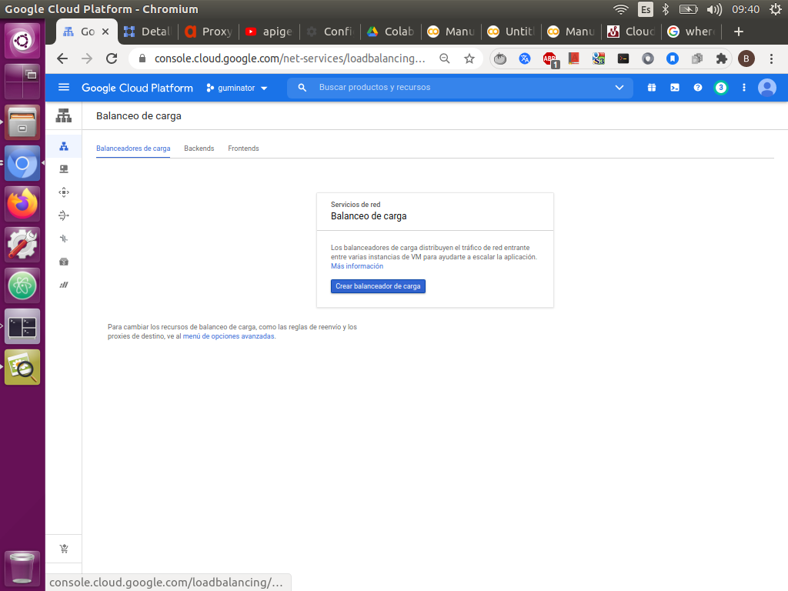
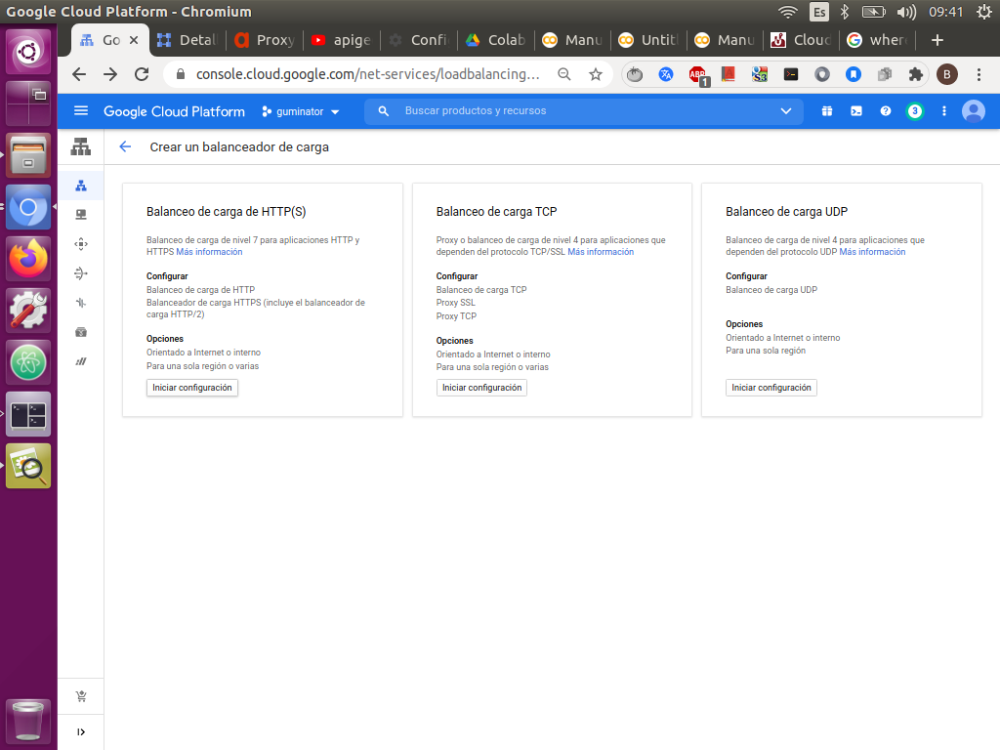
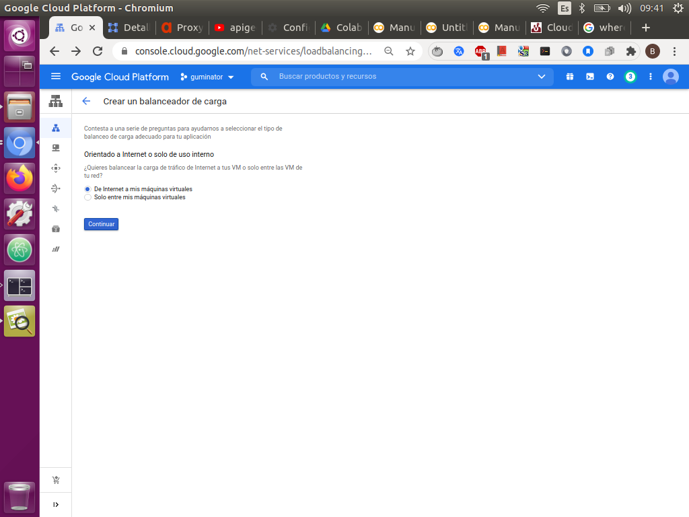
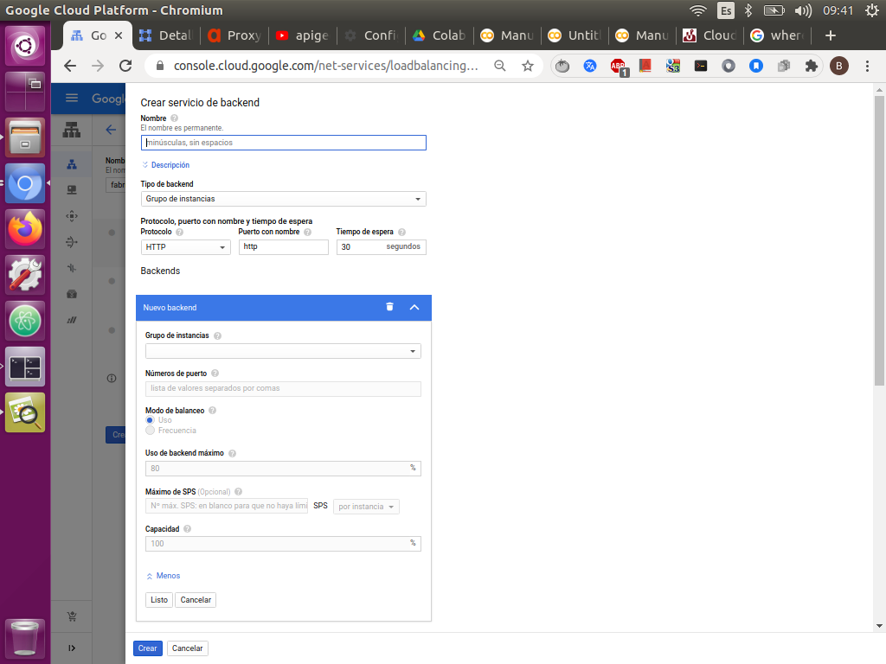
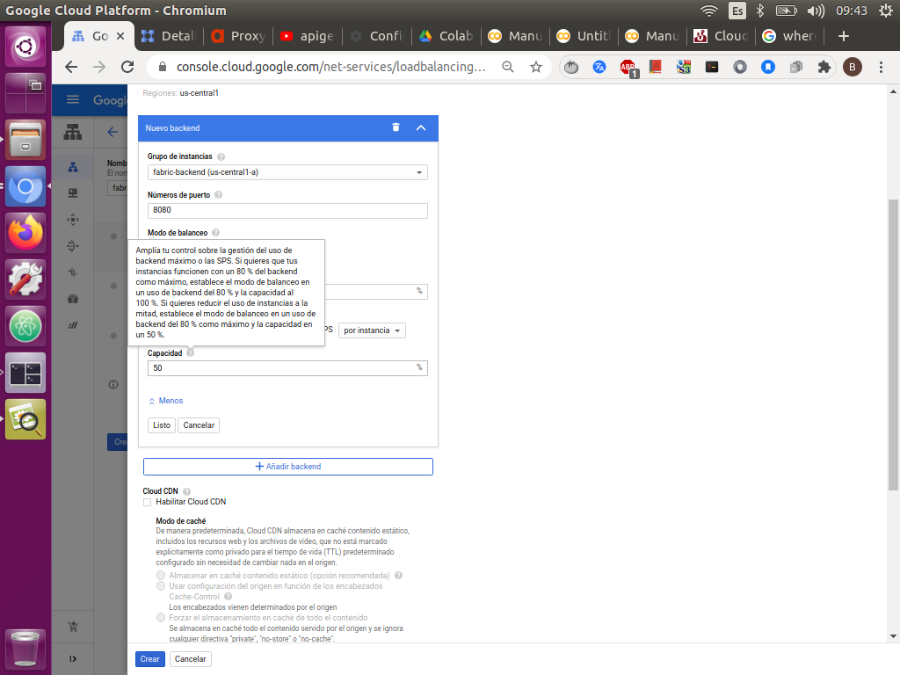
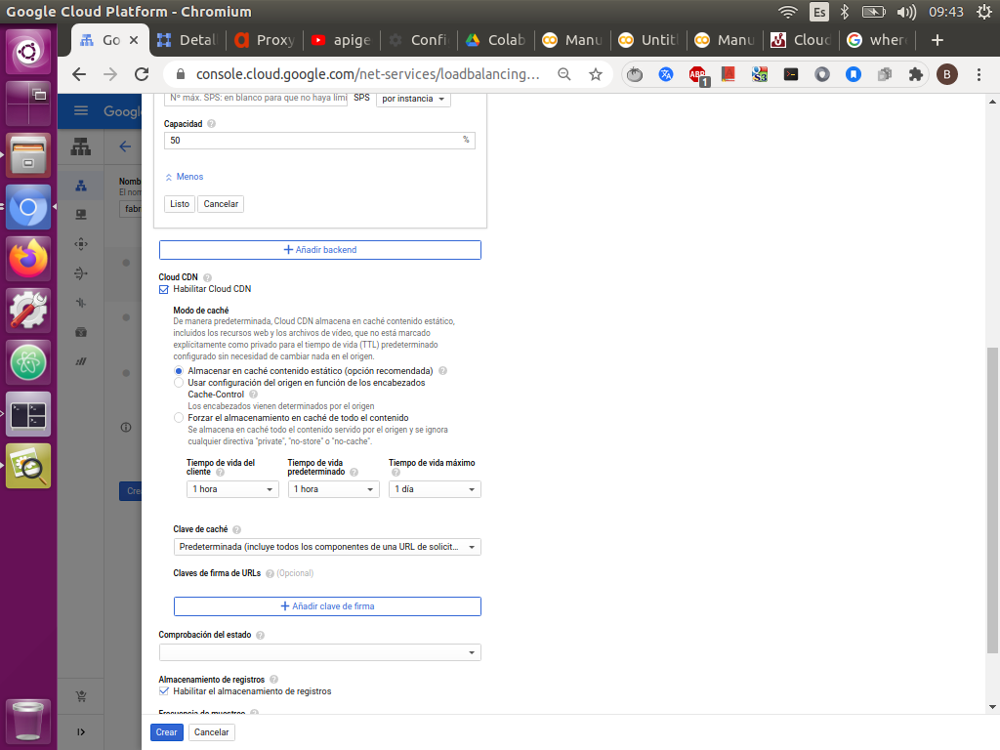
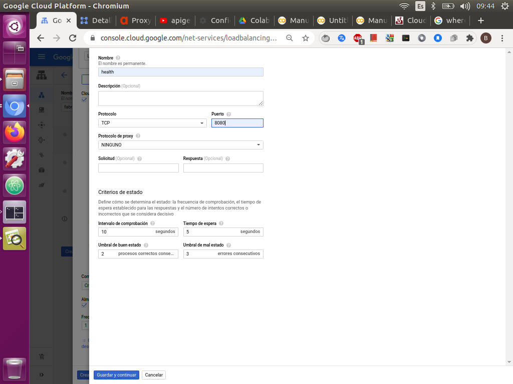
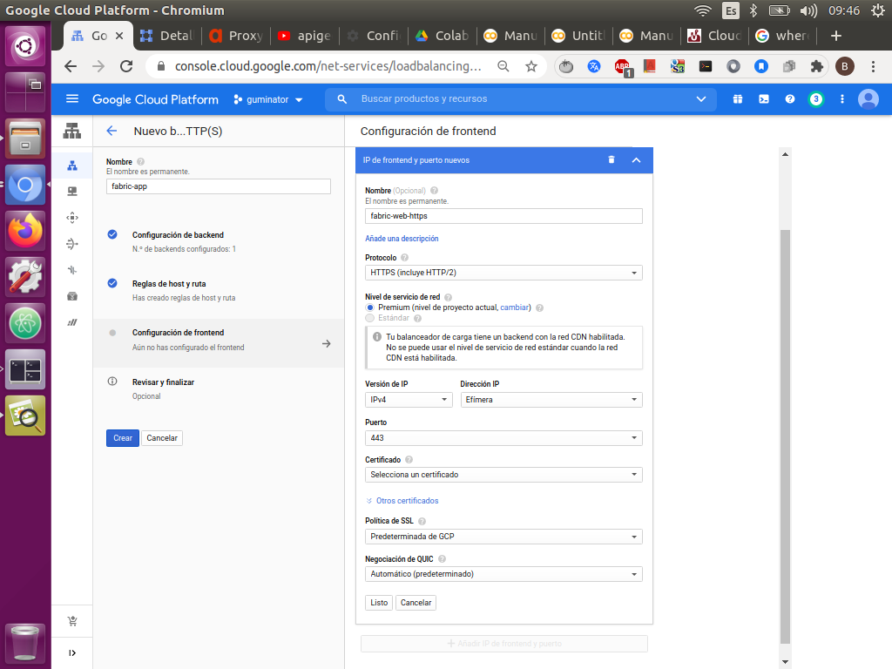
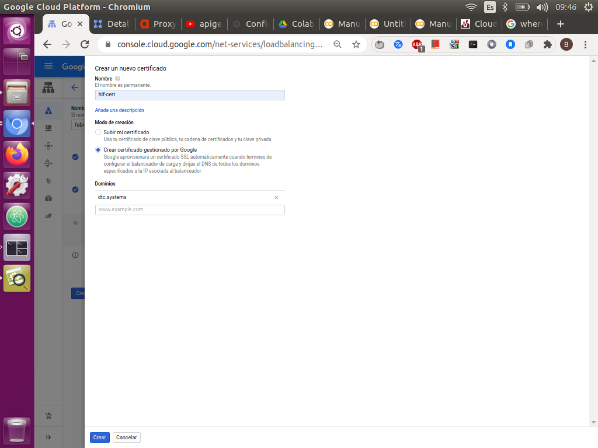
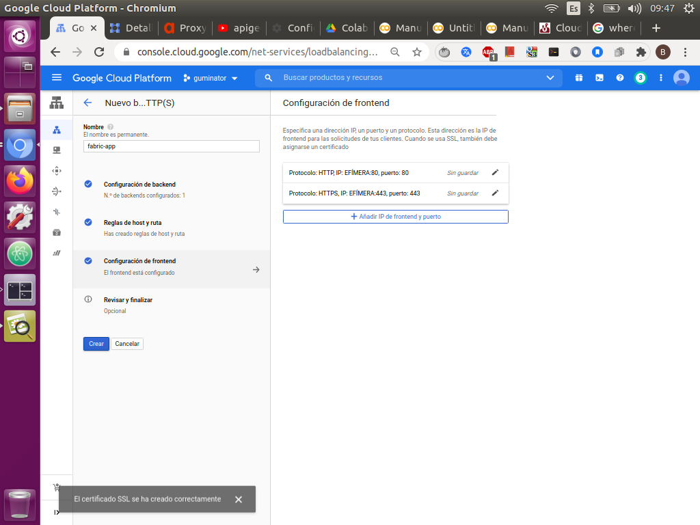

# Crear y conectar la aplicación a load balancing.
 
* Ir a la sección de [load balancing](https://console.cloud.google.com/net-services/loadbalancing/loadBalancers/list?project=guminator&authuser=0) en gcp.
 
* Haz clic en Crear balanceador de cargas.

 
*  Luego en Balanceo de cargas de HTTP(S) y haz clic en Iniciar configuración.
 
 
 
* Selecciona De Internet a mis VM y, luego, haz clic en Continuar.

 
* En el campo Nombre del balanceador de cargas, ingresa fabric-app-https o el nombre que tu quieras.

 
* Haz clic en Configuración de backend:
 
   - En Crear o seleccionar servicios y depósitos de backend, selecciona Servicios de backend > Crear un servicio de backend.
Agrega un nombre al servicio de backend, como fabric-backend o el que prefieras.

 
 
  - En Protocolo, selecciona HTTP.
 
  - En el Puerto con nombre, ingresa http.
 
  - En Backends > Nuevo Backend > Grupo de instancias, selecciona tu grupo de instancias, fabric-backend.
 
  - En Números de puerto, ingresa el puerto que usaste en cuando creaste el grupo de instancia y que corresponde al puerto donde la aplicación escucha.
 
  - Mantén la configuración predeterminada.
  
  
  
 * En la Sección Cloud CDN
 
   - Dale click en habilitar y deja la configuracíón en predeterminada.
   
   - Este servicio se usa para manejar el cache y permite que se pueda vizualizar el css de la aplicación.
   
    
 
* En Verificación de estado, selecciona:
 
   - Crear una verificación de estado y, luego, agrega un nombre para la verificación de estado, como http-basic-check.
 
   - Configura el protocolo como TCP y en puerto el puerto de la aplicacón.
   
   - Haz clic en Guardar y continuar.
 
   - Mantén la configuración predeterminada.
 
   - Haz clic en Crear.
   
    
 
 
* En Reglas de host y de ruta de acceso, mantén la configuración predeterminada.
 
* En Configuración de frontend, usa los siguientes valores:
  
  - Agragale el nombre que quieras pero que no seal igual al del balancer.

  - En Protocolo, establece HTTPS.
 
  - Configurar la dirección IP como efímera.
 
  - Asegúrate de que el valor de Puerto esté configurado como 443 para permitir el tráfico HTTPS.
  
   
 
  - Haz clic en la lista desplegable Certificado y selecciona en crear un nuevo certificado SSL, agregue un nombre y escoge la opcion de certificado gestionado por google, una vez hecho te pedira un nombre de dominio, en este caso se uso el dtc.systems de aws .
 
  - Haz clic en Listo.
 
  - Haz clic en Revisar y finalizar.
 
  
  - Cuando termines de configurar el balanceador de cargas, haz clic en Crear.
 
  
  
  - Espera a que se cree el balanceador de cargas.
  
  - Haz clic en el nombre del balanceador de cargas y en la pantalla detalles del balanceador de cargas, toma nota del valor de IP:Puerto de tu balanceador de cargas.
