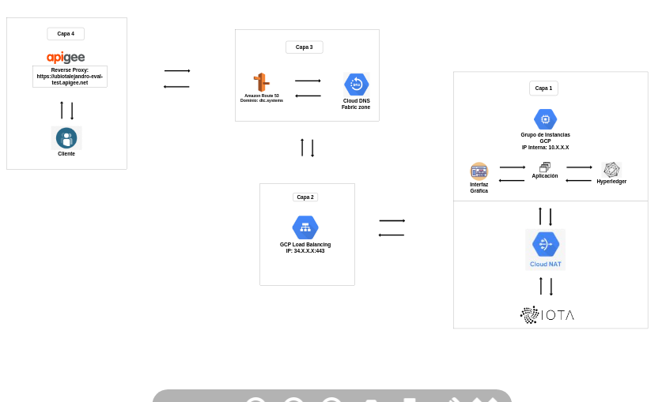

# Security-Architecture
Aquitectura de seguridad de la red 

Prerequisitos:
 
* Una vm o maquina entre 4gb 0 7gb de ram minimo y 30gb de almacenamiento
 
* Instalado los prerrequisitos de Hyperledger Fabric.
 
* Golang en sus versiones 1.13 o 1.14
 
---
 
 
 
# Esquema de Conexión:
 
 
  
  
  
  
 
 
 
 
# Capa 1: Conexión entre la Red de Fabric y la aplicación.
 
 
Esta corresponde a un instancia la cual se encuentra configurada con los siguientes elementos:
 
  * Red de fabric levantada con el chaincode ya instalado.
 
  * La aplicación que interactúa con dicha red.
 
  * Conexión a Cloud NAT (VM sin ip interna) como enlace seguro a un nodo de iota .
 
  * Adición a un grupo de instancia no administrado, con un puerto asignado y que corresponda con el de la aplicación.
 
 
 
 
# Capa 2: Conexion al Load balancer.
 
Esta capa corresponde a la conexión entre la instancia y un load balancer de tipo https.

 
# Capa 3: Registro de la Aplicación a un Dominio.
 
 
Esta capa corresponde al registro de la ip del balancear a tu domino propio (en este caso un dominio en AWS), este consta:
 
   * La Creación de un Zona con Cloud DNS y enlazarla a un Dominio en AWS.
 
   * El Registro de la ip del balancer a la zona.
 
 
# Capa 4: Conexión a apigee:
 
 
Esta capa corresponde a la conexion de la aplicación registrada en el dominio al entorno de apigee.

